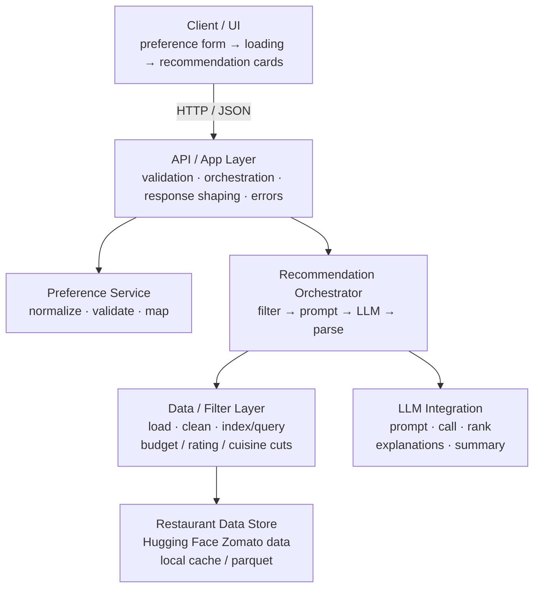
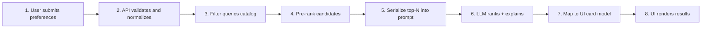
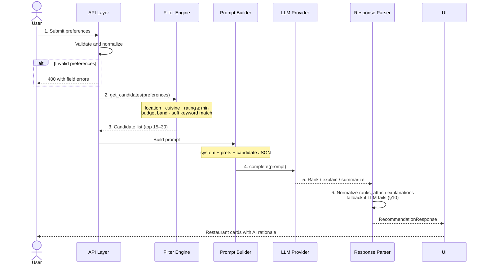
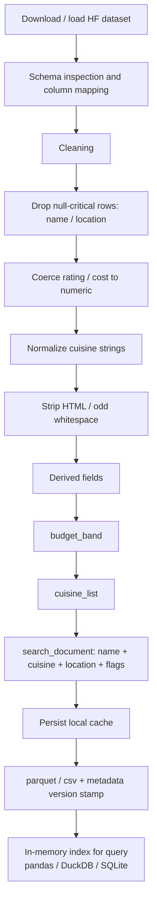
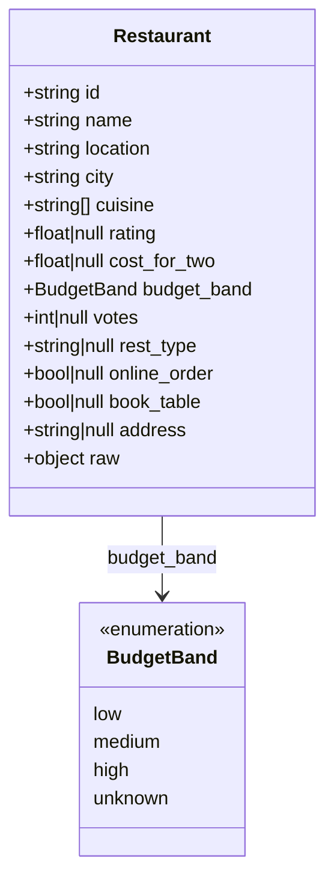
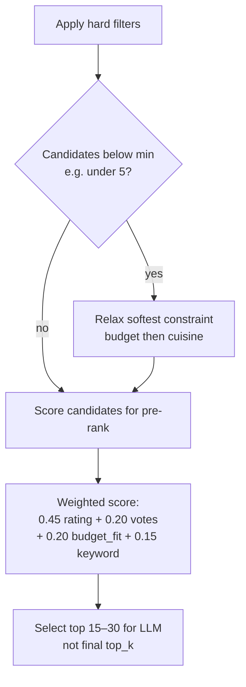
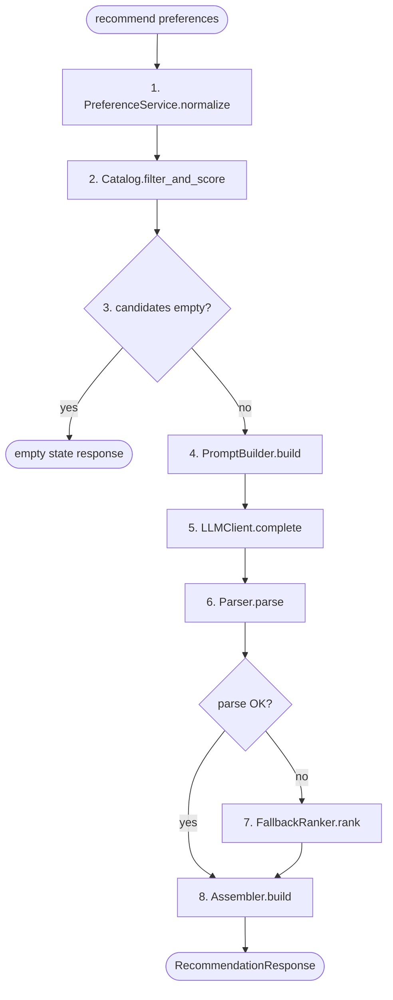
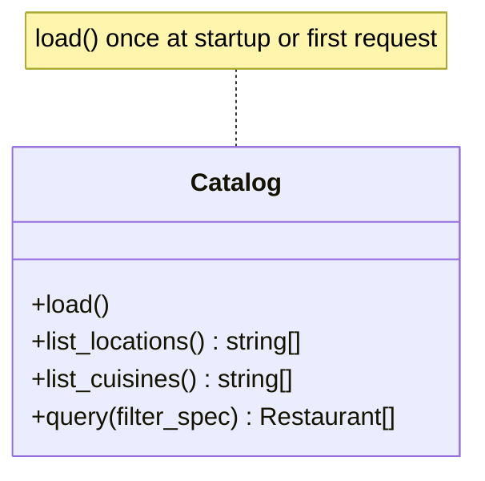
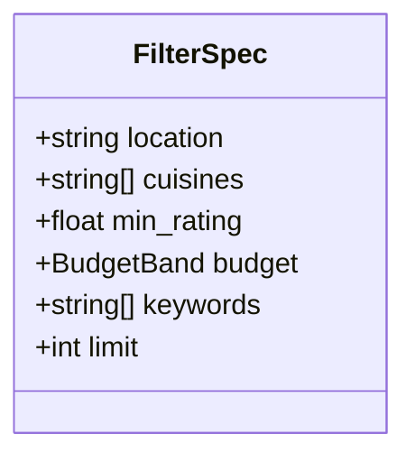
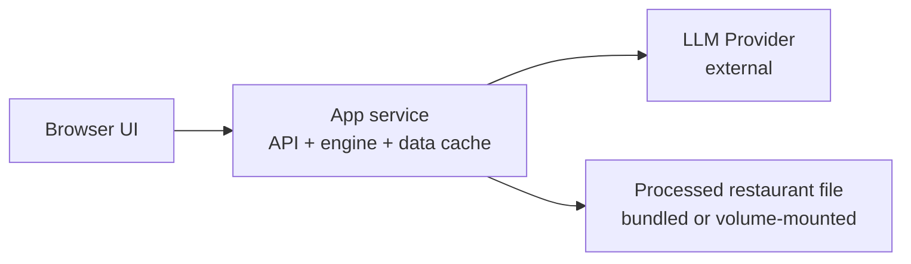

# Architecture: AI-Powered Restaurant Recommendation System

This document defines the system architecture for the Zomato-inspired restaurant recommendation service described in [problemStatement.md](./problemStatement.md). The system combines structured restaurant data with an LLM to produce ranked, explainable recommendations from user preferences.

---

## 1. Goals and Non-Goals

### Goals

- Accept structured user preferences (location, budget, cuisine, rating, free-text extras)
- Load and preprocess a real Zomato restaurant dataset from Hugging Face
- Pre-filter candidates with deterministic rules (speed, cost control, relevance)
- Use an LLM to rank candidates, explain fit, and optionally summarize
- Present top recommendations in a clear, user-friendly format

### Non-Goals (v1)

- Real-time inventory, menu, or live availability
- User accounts, login, or long-term personalization history
- Multi-city live booking / ordering
- Fine-tuning a proprietary model on restaurant reviews
- Full Zomato product parity (delivery, payments, social)

---

## 2. High-Level Architecture

The system is a **retrieve → filter → reason → present** pipeline.



### Architectural Style

| Choice | Rationale |
|---|---|
| Modular monolith (v1) | Simple to build and debug; clear service boundaries without distributed complexity |
| Hybrid retrieval + LLM | Hard filters enforce constraints; LLM supplies ranking and natural-language rationale |
| Stateless request handling | Each recommendation request is independent; no session store required |
| Cached dataset | Avoid re-downloading / re-parsing Hugging Face data on every request |

---

## 3. End-to-End Data Flow



### Detailed Sequence



---

## 4. Component Design

### 4.1 Client / Presentation Layer

**Responsibility:** collect preferences and display results.

**UI views**

1. **Preference form**
   - Location (select or free text)
   - Budget (`low` | `medium` | `high`)
   - Cuisine (multi-select or text)
   - Minimum rating (slider / number)
   - Additional preferences (textarea)
2. **Results view**
   - Ranked cards with:
     - Restaurant name
     - Cuisine
     - Rating
     - Estimated cost
     - AI-generated explanation
   - Optional global summary (“Best overall fit…”)
3. **Empty / error states**
   - No restaurants match filters
   - LLM unavailable (show filtered list with rule-based notes)

### 4.2 API / Application Layer

**Responsibility:** request contract, orchestration, error policy.

Suggested endpoints:

| Method | Path | Purpose |
|---|---|---|
| `GET` | `/health` | Liveness |
| `GET` | `/meta/filters` | Distinct locations, cuisines, budget bounds for form options |
| `POST` | `/recommend` | Main recommendation path |

#### `POST /recommend` contract

**Request**

```json
{
  "location": "Bangalore",
  "budget": "medium",
  "cuisine": ["Italian", "Continental"],
  "min_rating": 4.0,
  "additional_preferences": "family-friendly, quiet ambience",
  "top_k": 5
}
```

**Response**

```json
{
  "summary": "Strong Italian picks near your budget with solid ratings.",
  "recommendations": [
    {
      "rank": 1,
      "name": "Trattoria XYZ",
      "cuisine": "Italian",
      "rating": 4.4,
      "estimated_cost": 1200,
      "location": "Indiranagar, Bangalore",
      "explanation": "High rating, fits medium budget, and family-friendly seating options align with your ask.",
      "match_score": 0.91,
      "source": "llm"
    }
  ],
  "meta": {
    "candidates_considered": 22,
    "filters_applied": ["location", "cuisine", "rating", "budget"],
    "llm_model": "llama-3.1-8b-instant",
    "latency_ms": 1840
  }
}
```

### 4.3 Preference Service

**Responsibility:** normalize and validate user input before filtering.

| Field | Rules |
|---|---|
| `location` | Required; trim; case-normalize; fuzzy map to known cities/localities if possible |
| `budget` | Required enum: `low`, `medium`, `high` |
| `cuisine` | Optional list; casefold; alias map (e.g. “North Indian” ↔ “North-Indian”) |
| `min_rating` | Number, typically `0–5`; default e.g. `3.5` |
| `additional_preferences` | Free text; max length; optional keyword extraction |
| `top_k` | Integer `1–10`; default `5` |

**Budget mapping (example bands)** — tune to dataset currency/scale:

| Budget | Approx cost for two (example) |
|---|---|
| `low` | ≤ 500 |
| `medium` | 501–1500 |
| `high` | > 1500 |

### 4.4 Data Ingestion & Catalog Layer

**Source:** [ManikaSaini/zomato-restaurant-recommendation](https://huggingface.co/datasets/ManikaSaini/zomato-restaurant-recommendation)

#### Pipeline stages



#### Canonical restaurant record



Column names in the Hugging Face dataset may differ; the ingestion layer owns **source → canonical** mapping so the rest of the app stays stable.

### 4.5 Filter / Retrieval Engine (Integration Layer)

**Responsibility:** reduce full catalog to a small, preference-aligned candidate set **before** LLM reasoning.

This is critical for:

- Latency (smaller prompts)
- Cost control (fewer tokens)
- Relevance (hard constraints not left to the model)

#### Filter stages

| Stage | Type | Logic |
|---|---|---|
| Location | Hard | Exact or contains match on city/locality; expand to nearby localities if too few rows |
| Cuisine | Hard (if provided) | Intersection with restaurant cuisine list; partial string match |
| Rating | Hard | `rating >= min_rating` (exclude nulls or treat as fail) |
| Budget | Hard / soft | Primary: `cost_for_two` in band; Soft fallback: nearest band if empty |
| Additional prefs | Soft | Keyword hits on `rest_type`, name, or free-text fields (family, quick, outdoor, etc.) |
| Diversity (optional) | Soft | Cap candidates per cuisine / locality to avoid monotonous lists |

#### Candidate selection policy



1. Apply hard filters  
2. If `< min_candidates` (e.g. 5), relax softest constraint (budget → nearby budget; cuisine → related cuisines)  
3. Score candidates for pre-rank:
   - rating weight
   - vote count / popularity weight
   - budget proximity
   - keyword match boost
4. Select top **15–30** candidates for LLM (not the final top_k)

**Formula sketch (pre-rank):**

```text
score =
  0.45 * normalized_rating +
  0.20 * normalized_votes +
  0.20 * budget_fit +
  0.15 * keyword_match
```

Deterministic filtering answers: *“Which restaurants are even eligible?”*  
LLM ranking answers: *“Which of these best fit the person, and why?”*

### 4.6 Recommendation Engine (LLM Layer)

**Responsibility:** rank, explain, and summarize over structured candidates.

#### Subcomponents

| Module | Role |
|---|---|
| Prompt Builder | Assemble system + user + candidate context |
| LLM Client | Call provider API with timeouts, retries, temperature |
| Parser / Validator | Map model output into typed recommendations |
| Fallback Ranker | Rule-based ranking if LLM fails |

#### Prompt design principles

1. **System role:** restaurant recommendation assistant; stay faithful to provided data; no invented menus or ratings
2. **User block:** preferences in structured form
3. **Candidate block:** compact table/JSON of filtered restaurants only
4. **Output contract:** machine-parseable JSON ranking list
5. **Guardrails:** if uncertain, lower confidence rather than fabricate facts

#### Example system instructions (conceptual)

```text
You are a restaurant recommendation assistant for a Zomato-like product.
You must only recommend restaurants from the provided candidate list.
Do not invent ratings, costs, or amenities.
Rank by overall fit to user preferences.
For each pick, explain in 1–2 sentences why it matches.
Also provide one short overall summary.
Return valid JSON only.
```

#### Expected LLM output schema

```json
{
  "summary": "string",
  "recommendations": [
    {
      "id": "restaurant_id",
      "rank": 1,
      "explanation": "string",
      "fit_notes": ["budget", "cuisine", "family-friendly"]
    }
  ]
}
```

Post-processing joins LLM ranks back to full restaurant records (name, cuisine, rating, cost) so the model never needs to restate every structured field.

#### LLM configuration (defaults)

| Setting | Suggested v1 value | Why |
|---|---|---|
| Model class | Fast Groq chat model (default: `llama-3.1-8b-instant`) | Latency and cost |
| Temperature | 0.2–0.4 | Stable ranking, light phrasing variety |
| Max candidates in prompt | 15–30 | Context quality vs tokens |
| Top results returned | 5 (configurable) | UI clarity |
| Timeout | 15–30s | UX bound |
| Retries | 1–2 with backoff | Transient API errors |

### 4.7 Output Assembler

**Responsibility:** merge LLM rankings with catalog fields into the UI/API response.

Steps:

1. Validate ranks are within candidate set
2. Deduplicate by restaurant id
3. Fill missing structured fields from catalog
4. Attach `source: "llm"` or `"fallback"`
5. Compute response meta (counts, latency, model id)

---

## 5. Recommended Technology Stack (v1)

Opinionated defaults for a product/engineering demo; adjust per team constraints.

| Layer | Option A (Python-first) | Option B (JS-first) |
|---|---|---|
| UI | Streamlit / Gradio (fast) or React | Next.js / React |
| API | FastAPI | Next.js API routes / Express |
| Data load | `datasets` + pandas | `datasets` via Python sidecar, or static export to JSON/parquet |
| Local store | Parquet + pandas / DuckDB | Parquet + DuckDB WASM or SQLite |
| LLM | Groq (OpenAI-compatible) / OpenAI / Anthropic / Gemini API | Same |
| Config | `.env` + Pydantic settings | `.env` + zod |
| Packaging | `pyproject.toml` / poetry or uv | npm / pnpm |

**Suggested default for this project:** **Python + FastAPI + Streamlit/React + Hugging Face datasets + Groq (OpenAI-compatible LLM)**, because data prep and tabular filtering are natural in pandas and Groq gives fast JSON ranking without extra SDKs.

### Suggested repository layout

```text
Zomato-AI Recommendation/
├── docs/
│   ├── problemStatement.md
│   └── architecture.md
├── data/
│   ├── raw/                 # optional local dumps
│   └── processed/           # cleaned parquet/cache
├── src/
│   ├── app/
│   │   ├── main.py          # API entry
│   │   ├── routes/
│   │   └── schemas/         # request/response models
│   ├── data/
│   │   ├── ingest.py
│   │   ├── clean.py
│   │   └── catalog.py       # load + query interface
│   ├── preferences/
│   │   └── normalize.py
│   ├── filtering/
│   │   ├── filters.py
│   │   └── scorer.py
│   ├── llm/
│   │   ├── client.py
│   │   ├── prompts.py
│   │   └── parser.py
│   ├── engine/
│   │   └── recommend.py     # orchestrator
│   └── ui/                  # optional Streamlit or frontend
├── tests/
├── .env.example
├── requirements.txt / pyproject.toml
└── README.md
```

---

## 6. Core Domain Modules

### 6.1 Orchestrator (`recommend.py`)

Single path used by API/UI:



### 6.2 Catalog interface



### 6.3 Filter specification



---

## 7. Prompt & Context Strategy

### Why hybrid (filter + LLM)?

| Approach | Strength | Weakness |
|---|---|---|
| LLM-only over full dataset | Flexible language | Too many rows, hallucinations, high cost |
| Rule-only ranking | Fast, deterministic | Stiff explanations, weak free-text preference handling |
| **Hybrid (chosen)** | Hard constraints + natural ranking/explanations | Needs good prompt + parse fallbacks |

### Token budget guidance

- Keep candidate serialization dense: id, name, cuisine, rating, cost, location, type
- Omit long freeform reviews unless using embeddings later
- Put constraints at top of prompt; candidates next; JSON schema last

### Grounding policy

- LLM may only choose from provided IDs
- Parser drops any hallucinated restaurant IDs
- Explanations should reference known fields (rating, cuisine, budget fit, type)

---

## 8. State, Caching, and Performance

| Concern | Strategy |
|---|---|
| Dataset download | Cache under `data/processed/` with version hash |
| Startup | Eager-load catalog into memory or DuckDB |
| Repeated queries | Optional cache key = hash(preferences) for short TTL |
| LLM latency | Stream summary if UI supports; otherwise spinner + timeout |
| Candidate size | Hard-cap candidates sent to LLM |
| Cold start | Background ingest script before first user session |

### Latency budget (targets)

| Stage | Target |
|---|---|
| Validate + filter | < 100 ms (in-memory) |
| Prompt build | < 20 ms |
| LLM call | 1–4 s typical |
| Parse + assemble | < 50 ms |
| **Total end-to-end** | **~2–5 s** |

---

## 9. Configuration & Secrets

```text
HF_DATASET_ID=ManikaSaini/zomato-restaurant-recommendation
DATA_CACHE_DIR=./data/processed
LLM_PROVIDER=groq
LLM_MODEL=llama-3.1-8b-instant
GROQ_API_KEY=...
LLM_API_KEY=...
LLM_TIMEOUT_SECONDS=25
LLM_TEMPERATURE=0.3
DEFAULT_TOP_K=5
MAX_CANDIDATES_FOR_LLM=25
MIN_RATING_DEFAULT=3.5
LOG_LEVEL=INFO
```

Secrets live only in environment / secret manager — never in the dataset cache or client bundle. Groq is the default provider (`https://api.groq.com/openai/v1`). `GROQ_API_KEY` is preferred; `LLM_API_KEY` is accepted as a fallback.

---

## 10. Error Handling & Fallback Policy

| Failure | Behavior |
|---|---|
| Invalid preferences | HTTP 400 with field errors |
| Dataset missing / corrupt | Fail startup or `/health` degraded; surface setup message |
| Filters return zero rows | Empty recommendations + suggestions to broaden filters |
| LLM timeout / 5xx | Retry once; then fallback ranker + templated explanations |
| LLM invalid JSON | Repair/retry once; then fallback |
| Hallucinated IDs | Drop invalid IDs; fill remaining from pre-ranked list |

**Fallback explanation template example:**

> Ranked by rating and budget fit for {cuisine} in {location}.

This protects demo reliability without presenting a blank screen.

---

## 11. Observability

Minimum logs and metrics for product iteration:

- Request id, latency breakdown (filter vs LLM)
- Candidate count before/after each filter stage
- LLM success / fallback rate
- Empty result rate by city/cuisine
- Token usage (if provider exposes it)

Useful for tuning budget bands, default rating, and candidate caps.

---

## 12. Security & Safety

- Validate and bound all user inputs (length, enums, rating range)
- Never put API keys in frontend code
- Truncate free-text preferences before prompt injection risk grows large
- System prompt forbids following user instructions that override ranking rules
- Do not log full prompts if they may contain sensitive content in multi-tenant future versions

---

## 13. Testing Strategy

| Layer | What to test |
|---|---|
| Unit | budget mapping, cuisine normalization, filter logic, parser |
| Contract | request/response schemas |
| Integration | ingest sample → query → candidates non-empty |
| LLM (golden / snapshot) | fixture candidates + mock LLM → ranked response |
| E2E | submit form → receive ranked cards |
| Failure paths | empty filters, LLM outage → fallback ranking |

Use a **small fixture subset** of the Zomato dataset in CI to avoid network downloads in tests.

---

## 14. Deployment Topology (v1)



Single process/container is enough for v1. Scale later by:

- Separating UI and API
- Moving catalog to SQLite/Postgres
- Adding embeddings search for “more like this” free-text matching

---

## 15. Future Extensions (Out of Scope for v1)

| Extension | Description |
|---|---|
| Embeddings retrieval | Vector search over cuisine + review text for soft preference match |
| User sessions | Save preferences and past clicks for personalization |
| Multi-turn chat | Conversational refine: “cheaper”, “more vegetarian options” |
| Map view | Geo-coordinates + distance ranking |
| A/B ranking | Compare pure rules vs hybrid LLM explanations |
| Fine-tuned ranker | Learn pairwise preference from interaction logs |

---

## 16. Mapping Architecture → Problem Statement

| Problem statement step | Architecture component |
|---|---|
| Data Ingestion | Data catalog / ingest pipeline (§4.4) |
| User Input | UI form + Preference Service (§4.1, §4.3) |
| Integration Layer | Filter engine + prompt builder (§4.5, §4.6) |
| Recommendation Engine | LLM client + parser + fallback (§4.6) |
| Output Display | Response assembler + UI recommendation cards (§4.1, §4.7) |

---

## 17. Implementation Phases

### Phase 0 — Foundations

- Project scaffolding, env config, docs
- Dataset download + cleaning + local cache
- Canonical schema + basic explore notebook/script

### Phase 1 — Deterministic recommendations

- Preference model + filters + scorer
- API `POST /recommend` returning rule-ranked results
- Simple UI form + list view

### Phase 2 — LLM layer

- Prompt templates, provider client, JSON parse
- Rank + explain + summary in response
- Fallback behavior and error states

### Phase 3 — Product polish

- Filter option endpoints for UI dropdowns
- Latency/empty-result observability
- Edge-case tuning (few matches, multi-cuisine, free-text extras)

---

## 18. Summary

This architecture implements a **hybrid recommender**:

1. **Structured data** supplies a clean restaurant catalog.
2. **Hard filters** enforce location, cuisine, rating, and budget constraints.
3. **An LLM** ranks and explains the shortlist in natural language.
4. **A thin API/UI layer** collects preferences and displays grounded recommendations.

The design prioritizes relevance, explainability, controlled LLM cost, and reliability through deterministic fallbacks — matching the problem statement without requiring a full real-time dining platform.
