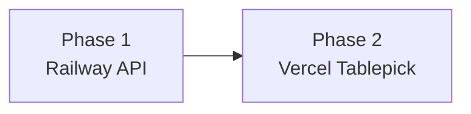
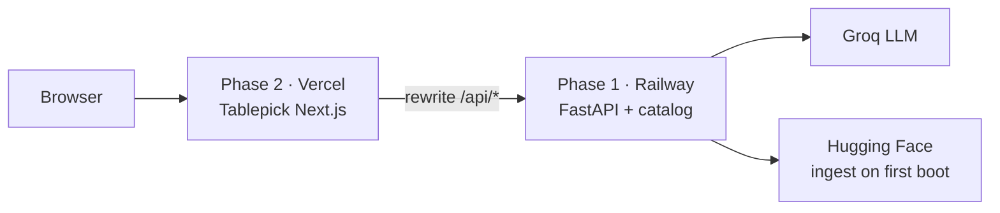
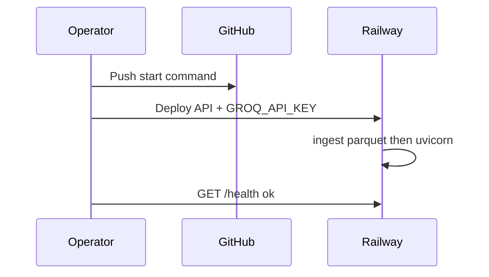
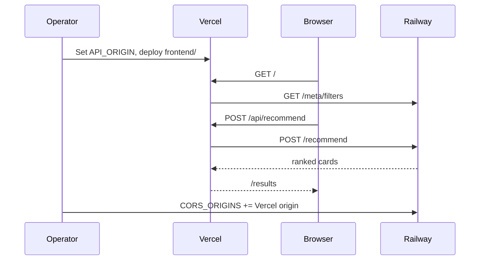

# Deployment Plan: Railway (API) + Vercel (Tablepick)

Plan to ship the hybrid recommender as two services: **FastAPI on Railway**, **Next.js Tablepick on Vercel**. Local dual-process (`uvicorn` + `next dev`) stays the development path; this document covers production topology, env, catalog, and first-deploy sequencing.

**Does not change** the product contract: browser talks only to the Next origin; Groq keys stay on the API; catalog fields remain source of truth for name / cuisine / rating / cost.

Related: [architecture.md](./architecture.md) §9 (config) and §14 (topology) · [implementation-plan.md](./implementation-plan.md) · [README.md](../README.md)

---

## Plan Overview

| Phase | Name | Where | Primary outcome | Unlocks |
|---|---|---|---|---|
| 1 | Backend on Railway | Repo root → FastAPI | Public HTTPS API with catalog + Groq | Phase 2 `API_ORIGIN` |
| 2 | Frontend on Vercel | `frontend/` → Next.js | Public Tablepick UI proxying `/api/*` to Railway | Shareable product demo |



Do **not** start Phase 2 until Phase 1 `/health` is `ok`. Vercel bakes `API_ORIGIN` at build time; a localhost default would ship a broken UI.



Public URLs (illustrative):

| Phase | Service | Example origin |
|---|---|---|
| 1 | API | `https://zomato-api-production.up.railway.app` |
| 2 | Tablepick | `https://tablepick.vercel.app` |

Users open the Vercel URL. The Next app calls `/api/meta/filters` and `/api/recommend`; Vercel proxies those to Railway `/meta/filters` and `/recommend`.

---

## Locked decisions

| Choice | Decision | Why |
|---|---|---|
| Backend host | **Railway** web service from repo root | Persistent process, enough RAM for in-memory parquet, outbound Groq + Hugging Face |
| Frontend host | **Vercel** project with root `frontend/` | Native Next.js 15 App Router; same rewrite BFF as local |
| Process split | Two services, not a single container | Matches architecture “scale later by separating UI and API”; Vercel is the right home for Tablepick |
| Browser → API | Next.js `rewrites` `/api/:path*` → Railway origin | Same as local (`next.config.ts`); no Groq key in the browser |
| Catalog | Processed parquet on Railway disk | API **refuses to boot** without `data/processed/restaurants.parquet` |
| Secrets | `GROQ_API_KEY` only on Railway | Architecture §12; Vercel never needs an LLM key |
| Not deploying | Streamlit (`src/ui/app.py`) | Phase 4 product UI is Tablepick |

---

## Phase 1 — Backend on Railway

**Goal:** A public FastAPI service that loads the restaurant catalog, answers `/health`, `/meta/filters`, and `/recommend`, and holds the Groq key.

**Maps to architecture:** App service + data cache + LLM provider (§4.2, §9, §14)  
**Depends on:** Processed catalog path (`python -m src.data.ingest`); `src.app.main:app`

### Deliverables

- Railway web service from **repo root** (Python package, not `frontend/`)
- Start command that ingests parquet if needed, then binds `0.0.0.0:$PORT`
- Env: Groq key, Python 3.11, `PYTHONPATH=.`
- Volume at `DATA_CACHE_DIR` so restarts do not re-download Hugging Face
- Health check on `GET /health`
- Public HTTPS origin to hand to Phase 2 as `API_ORIGIN`

### Gaps this phase closes

Nothing in-repo previously bound `$PORT` or shipped a production start command, and the parquet is gitignored. **G1–G3 are implemented in repo** (`railway.toml`, `scripts/start-api.sh`, `src/app/run.py`). G2 still needs a Railway Volume (or ingest-on-every-boot) at deploy time.

| # | Gap | Risk if skipped | Fix |
|---|---|---|---|
| G1 | Uvicorn hardcoded to `:8000` in local README | Railway health check 502 — platform injects `$PORT` | **Done:** `src.app.run` reads `$PORT` (default 8000) |
| G2 | `data/processed/*` is gitignored (~2.4 MB parquet) | API startup raises `CatalogCacheError` / 503 | **Done in start:** ingest-on-boot; attach Volume at `/data/processed` so it sticks |
| G3 | Nixpacks may not guess `src.app.main:app` (and may detect Node from `frontend/`) | Wrong start or Node build | **Done:** `railway.toml` + `nixpacks.toml` `providers = ["python"]` |
| G6 | `/recommend` can take ~2–30s (Groq timeout 25s + one retry) | Proxy idle timeout → 504 in Phase 2 | Persistent web service (not a one-shot job) |

**Catalog (G2):** start command runs ingest, then uvicorn. Mount a Volume so later restarts reuse the cache (`src.data.ingest` skips Hugging Face when the cache is fresh). Do not commit the parquet unless ingest-at-boot proves too slow or HF is blocked.

### Service shape

- **Builder:** Nixpacks (reads `pyproject.toml`) unless a Dockerfile is added later
- **Runtime:** persistent web service (not a one-shot job, not cron)
- **Memory:** start at **1 GB**. Catalog is ~52k rows loaded into pandas at boot
- **Public networking:** generate a Railway HTTPS domain; path `/` is 404 (no UI there) — that is expected

### Start command (in repo)

`scripts/start-api.sh` → `python -m src.app.run`: ingest if the cache is missing, then uvicorn on `0.0.0.0:$PORT` (default 8000 locally). If `/data/processed` exists and `DATA_CACHE_DIR` is unset, that Volume path is used.

| Piece | Why |
|---|---|
| `python -m src.data.ingest` | Writes parquet if missing; no-ops when cache is fresh |
| `uvicorn src.app.main:app` | Same app object as local |
| `--host 0.0.0.0 --port $PORT` | Railway proxy health checks (`src.app.run.listen_port`) |

First boot without a Volume downloads Hugging Face, cleans, writes parquet, then warms the catalog. Budget **3–5 minutes** for healthcheck timeout on that first deploy.

Config files at repo root: `railway.toml`, `nixpacks.toml` (Python 3.11 only — ignores `frontend/package.json`), `.python-version`, `.nixpacksignore`.

### Environment variables

| Variable | Required | Notes |
|---|---|---|
| `PORT` | Injected | Do not override. Pass through to uvicorn |
| `GROQ_API_KEY` | Yes for LLM path | From [console.groq.com/keys](https://console.groq.com/keys). Without it, API still serves `source: fallback` |
| `LLM_PROVIDER` | Optional | Default `groq` |
| `LLM_MODEL` | Optional | Default `llama-3.1-8b-instant` |
| `LLM_TIMEOUT_SECONDS` | Optional | Default `25`. Do not lower below ~15 s or Groq will flap to fallback on cold starts |
| `CORS_ORIGINS` | After Phase 2 URL exists | Leave localhost for Phase 1 smoke tests. Add the Vercel origin in Phase 2 |
| `DATA_CACHE_DIR` | If using a Volume | e.g. `/data/processed` matching the mount |
| `HF_DATASET_ID` | Optional | Default `ManikaSaini/zomato-restaurant-recommendation` |
| `NIXPACKS_PYTHON_VERSION` | Recommended | `3.11` (local is 3.9; 3.11 is safer for pandas/pyarrow) |
| `PYTHONPATH` | Recommended | `.` so `src.app.main:app` imports |
| `LOG_LEVEL` | Optional | `INFO` |
| `RECOMMEND_CACHE_TTL_SECONDS` | Optional | `60` is reasonable in prod to blunt duplicate clicks |

Never set LLM keys on Vercel.

### Volume (strongly recommended after first successful ingest)

| Setting | Value |
|---|---|
| Mount path | `/data/processed` |
| `DATA_CACHE_DIR` | `/data/processed` |

Without a Volume, every new container (deploy or restart) has an empty disk and re-downloads the dataset.

### Health check and outbound network

- Path: `/health`
- Success: HTTP 200 and JSON `status` is `ok` (catalog loaded). `degraded` means ingest did not persist — do not start Phase 2
- Railway should use this path so it does not treat `/` 404 as the health signal

Railway must reach:

- `https://api.groq.com` (rank + explain)
- `https://huggingface.co` (ingest only)

### Work breakdown

| # | Task | Detail |
|---|---|---|
| 1.1 | Start command | `railway.toml` + `scripts/start-api.sh` + `src/app/run.py` (ingest + `$PORT`) — **done in repo** |
| 1.2 | GitHub | Push `main` (or the deploy branch). Connect Railway to this repo, **root directory empty** (repo root) |
| 1.3 | Create service | New Railway project → Nixpacks → 1 GB RAM → public HTTPS domain |
| 1.4 | Env | `GROQ_API_KEY`, `PYTHONPATH=.`, `NIXPACKS_PYTHON_VERSION=3.11` |
| 1.5 | First boot | Wait for ingest + uvicorn; healthcheck timeout ≥ 300 s |
| 1.6 | Smoke API | `/health`, `/meta/filters`, `POST /recommend` (see exit criteria) |
| 1.7 | Volume | Attach Volume; set `DATA_CACHE_DIR`; one restart to prove ingest is skipped |



### Exit criteria (Phase 1 done when)

- [ ] `GET {railway}/health` → `status: ok`, `catalog_rows` &gt; 0, `llm.configured` true if a key was set
- [ ] `GET {railway}/meta/filters` → `locations` includes Indiranagar / BTM; `Bangalore` is only in `cities`
- [ ] `POST {railway}/recommend` with `{ "location": "Indiranagar", "budget": "medium", "cuisine": ["Italian"], "min_rating": 4, "top_k": 5 }` → 200, non-empty `recommendations` **or** documented empty + `meta.suggestions`
- [ ] Railway logs show `request_id`, `filter_ms` / `llm_ms`, not a crash loop
- [ ] Public HTTPS origin recorded for Phase 2 `API_ORIGIN` (no trailing slash)

### Dependencies / risks

| Risk | Mitigation |
|---|---|
| First ingest exceeds healthcheck | `healthcheckTimeout = 300`; Volume so it is one-time |
| Hugging Face blocked / rate-limited | Bake parquet into image or commit `data/processed/` for demo only |
| Railway 512 MB OOM | 1 GB RAM; pandas + pyarrow + datasets is heavy |
| Groq outage during a demo | Fallback ranker is the feature; `/health` still `ok` |
| Redeploy wipes catalog | Volume on `DATA_CACHE_DIR` |
| Streamlit pulled into the image | Acceptable for v1 (`pyproject.toml` lists it). Slim `requirements.prod.txt` is post-v1 |

---

## Phase 2 — Frontend on Vercel

**Goal:** Ship Tablepick as a public Next.js app that matches local UX and proxies `/api/*` to the Phase 1 Railway origin.

**Maps to architecture:** Client / presentation layer (§4.1)  
**Depends on:** Phase 1 `/health` = `ok` and a stable Railway HTTPS origin

### Deliverables

- Vercel project with Root Directory `frontend/`
- `API_ORIGIN` set at **build** and runtime (Phase 1 URL)
- Production Tablepick: Neighborhood from catalog `location`, recommend → `/results`
- Nav is **Recommendations only** (no Saved, History, Settings, or Account)
- Railway `CORS_ORIGINS` updated with the Vercel origin (for direct API clients; UI itself is same-origin)

### Gaps this phase closes

| # | Gap | Risk if skipped | Fix |
|---|---|---|---|
| G4 | `API_ORIGIN` defaults to `http://127.0.0.1:8000` | Production UI proxies to localhost | Set `API_ORIGIN` on Vercel **at build time** |
| G5 | `CORS_ORIGINS` is localhost-only | Direct browser hits to Railway fail; rewrite path is same-origin so UI still works | Add the Vercel origin after the frontend URL exists |

### Project settings

| Setting | Value |
|---|---|
| Root Directory | `frontend` |
| Framework Preset | Next.js |
| Build Command | `npm run build` (default) |
| Install Command | `npm install` (default) |
| Output | Next.js (not static export — rewrites need the Next server) |
| Node | 18+ (Vercel default is fine) |

Ignore `frontend/.next` and `node_modules` (already gitignored).

### Environment variables

| Variable | Required | Scope |
|---|---|---|
| `API_ORIGIN` | **Yes** | Production (and Preview if the preview UI should hit the same API). **Build** + Runtime. No trailing slash. Example: `https://zomato-api-production.up.railway.app` |

`next.config.ts` reads `API_ORIGIN` when defining rewrites. If it is missing at **build**, the rewrite target stays `http://127.0.0.1:8000` and production Neighborhood / recommend calls fail.

Do **not** add `NEXT_PUBLIC_*` Groq keys. The browser only calls same-origin `/api/...`. Never put `GROQ_API_KEY` / `LLM_API_KEY` on Vercel.

### Rewrite contract (already in code)

```ts
// frontend/next.config.ts
const API_ORIGIN = process.env.API_ORIGIN ?? "http://127.0.0.1:8000";
// /api/:path*  →  ${API_ORIGIN}/:path*
```

| Browser calls | Proxied to Railway |
|---|---|
| `/api/health` | `{API_ORIGIN}/health` |
| `/api/meta/filters` | `{API_ORIGIN}/meta/filters` |
| `/api/recommend` | `{API_ORIGIN}/recommend` |

Because the browser stays on the Vercel origin, **CORS is not required for Tablepick**. Set Railway `CORS_ORIGINS` anyway so `curl` and future direct clients work.

Preview deployments: either point Preview `API_ORIGIN` at the same Railway service, or skip Preview until a staging API exists. Wildcard Vercel preview hosts (`*.vercel.app`) are awkward with the current exact-origin CORS list; the rewrite path does not need them.

### Timeouts

| Hop | Budget | Notes |
|---|---|---|
| Filter + score | &lt; 100 ms | In-memory catalog (Phase 1) |
| Groq | 1–4 s typical, 25 s cap, 1 retry | Worst case ~50 s if both attempts time out |
| Railway request | Platform default (minutes) | Fine for v1 |
| Vercel rewrite / proxy | Watch for **504** on `/results` | Hobby serverless functions are **10 s** if we ever replace rewrites with Route Handlers without raising `maxDuration` |

If production `/recommend` 504s:

1. Confirm Railway logs show the request finishing (fallback vs LLM).
2. Prefer keeping `next.config` rewrites (routing proxy) rather than a Next Route Handler on Hobby.
3. If a Route Handler is required, set `maxDuration = 60` (needs Vercel Pro) **or** call Railway from the browser with `CORS_ORIGINS` set (LLM key still never ships to Vercel).

### Work breakdown

| # | Task | Detail |
|---|---|---|
| 2.1 | Import project | Vercel ← GitHub; Root Directory `frontend` |
| 2.2 | Env | Set `API_ORIGIN` to the Phase 1 HTTPS origin **before** the first production build |
| 2.3 | Deploy | `npm run build` on Vercel; confirm rewrite target in build logs |
| 2.4 | Browser smoke | Neighborhood list loads; demo pill **Indiranagar · Italian · medium**; results cards render |
| 2.5 | CORS back to API | Add Vercel origin to Railway `CORS_ORIGINS`; redeploy Phase 1 (fast if Volume is warm) |
| 2.6 | Optional | Custom domains on both; update `CORS_ORIGINS` and `API_ORIGIN` (then **rebuild** Vercel) |



### Exit criteria (Phase 2 done when)

- [ ] Vercel `/` shows Tablepick (Newsreader + dark `#0E1114`); Neighborhood suggestions are localities from `location`, not `city`; shell nav is Recommendations only (no Saved / History / Settings / Account)
- [ ] Submit → `/results` hero + rows; gold quote when `explanation` present; fallback label when `source=fallback`
- [ ] Empty query (e.g. location `Atlantis`, cuisine `Martian`) stays on Tablepick empty state, not a blank 500
- [ ] Vercel project env has no Groq/LLM keys
- [ ] Railway `CORS_ORIGINS` includes the production Vercel origin

### Dependencies / risks

| Risk | Mitigation |
|---|---|
| Vercel built before `API_ORIGIN` set | Rebuild after setting the var; confirm rewrite target in build logs |
| Phase 1 not green | Do not deploy Production until `/health` is `ok` |
| Preview URLs vs CORS | Tablepick uses same-origin rewrite; only production origin needed for CORS |
| `/recommend` 504 | See Timeouts; keep config rewrites on Hobby |

---

## Cross-phase sequencing

| Step | Phase | Action |
|---|---|---|
| 0–1.7 | 1 | Start command, Railway deploy, ingest, `/health` ok, Volume |
| 2.1–2.4 | 2 | Vercel + `API_ORIGIN` + browser smoke |
| 2.5 | 1 (small) | Add Vercel origin to `CORS_ORIGINS` |
| 2.6 | 2 (optional) | Custom domains + rebuild |

---

## Out of scope for this cut

- Custom domains and TLS beyond platform defaults (optional 2.6)
- Staging vs production Railway environments
- CI deploy gates (pytest on GitHub Actions already uses fixtures; optional “deploy after green”)
- Dockerfile / multi-stage slim image
- Moving catalog to Postgres
- CDN caching of `/meta/filters` (keep `cache: "no-store"` until facets are versioned)
- Deploying Streamlit
- Saved, History, Settings, and Account in Tablepick (Recommendations is the only nav destination)

---

## Document map

| Doc | Role |
|---|---|
| [problemStatement.md](./problemStatement.md) | What to build |
| [architecture.md](./architecture.md) | How components fit; §14 was a single process — this plan splits UI/API |
| [implementation-plan.md](./implementation-plan.md) | Build order (product Phases 0–4) |
| **deployment-plan.md** (this file) | Ship order: Phase 1 Railway, Phase 2 Vercel |
| [../README.md](../README.md) | Local runbook |

---

## Summary

**Phase 1** deploys FastAPI on Railway (ingest catalog, bind `$PORT`, Groq key, `/health`). **Phase 2** deploys Tablepick on Vercel (`frontend/`, `API_ORIGIN` at build time). The browser never holds LLM secrets. Neighbourhoods stay sourced from the catalog `location` column. Production is done when the Vercel UI can load localities and return grounded recommendations from the Railway API.
