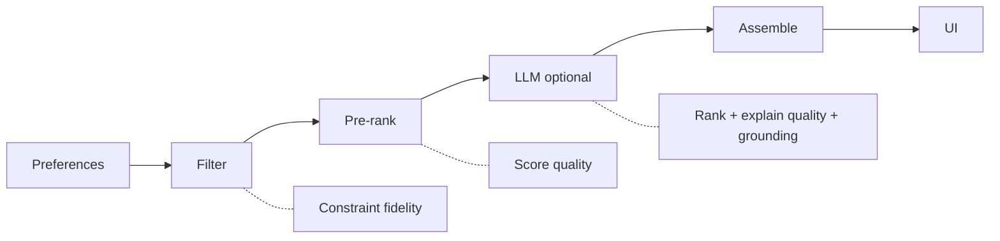

# Evaluation Plan: AI-Powered Restaurant Recommendation System

How we measure whether the hybrid recommender (filter → score → LLM rank/explain) meets product goals from the problem statement, design targets from [architecture.md](./architecture.md), and phase exit criteria from [implementation-plan.md](./implementation-plan.md).

Related: [edge-case.md](./edge-case.md) defines failure modes; this doc defines **success metrics, eval sets, methods, and pass bars**.

---

## 1. Purpose of Evaluation

| Audience | Decision |
|---|---|
| Engineering | Is the pipeline correct, grounded, and fast enough? |
| Product | Are recommendations relevant, explainable, and demo-ready? |
| Iteration | What to tune (budget bands, candidate cap, prompts, relaxation)? |

**Core question:** Given user preferences, does the system return **eligible**, **well-ranked**, **honestly explained** restaurants within **latency/cost** limits — and **degrade safely** when the LLM fails?

---

## 2. What We Evaluate (Layers)

The architecture is multi-stage. Each stage gets different metrics.



| Layer | Eval focus | Fail means |
|---|---|---|
| **Data / catalog** | Schema, non-empty coverage, cleaned types | Downstream lies (null crashes, wrong units) |
| **Preference validation** | Accept/reject contract | Bad inputs produce undefined behavior |
| **Hard filters** | Constraint fidelity | Violations of location/cuisine/rating/budget |
| **Retrieval / recall** | Eligible restaurants surface in candidate pool | Good matches never reach LLM/UI |
| **Rule ranking** | Sensible order without LLM | Weak Phase 1 demos / weak fallbacks |
| **LLM ranking** | Preference fit over shortlist | Random or off-preference order |
| **LLM explanations** | Faithful, useful, non-hallucinated | Invented amenities/ratings |
| **Grounding / safety** | IDs only from candidates | Fake restaurants shown |
| **Reliability** | Fallback & empty handling | Blank pages / hard crashes |
| **Performance** | Latency budget | UX exceeds 2–5s typical / 30s timeout |
| **Cost** | Tokens / request | Unsustainable demo/prod spend |

---

## 3. Evaluation Modes

| Mode | When | LLM live? | Use |
|---|---|---|---|
| **Unit / contract** | CI every PR | Mocked | Filters, parser, schemas |
| **Offline fixture eval** | CI + local | Mocked or none | Golden preference → known candidate sets |
| **Offline full-catalog eval** | Nightly / pre-demo | Optional | Coverage stats, empty rates by city |
| **LLM live smoke** | Pre-demo / release | Yes | Real ranking + explanation quality |
| **Human rubric review** | Phase 2–3 | Yes | Explanation usefulness, preference fit |
| **A/B comparison** | Phase 3+ | Both | Rules-only vs hybrid LLM |
| **Online / product logs** | After UI ship | Mixed | Latency, fallback rate, empty rate |

**Rule:** CI must not depend on Hugging Face or a live LLM. Use offline fixtures (implementation-plan working agreement).

---

## 4. Metric Dictionary

### 4.1 Constraint fidelity (hard filters)

Computed on returned recommendations **before** relaxation flags (or computed both strict and relaxed).

| Metric | Definition | Target (v1) |
|---|---|---|
| **Location pass rate** | % recommendations whose location/city matches policy | **100%** on strict set |
| **Cuisine pass rate** | % with cuisine intersecting requested list (if cuisine set) | **100%** strict |
| **Rating pass rate** | % with `rating >= min_rating` and non-null | **100%** strict |
| **Budget pass rate** | % with `cost_for_two` in (or adjacent if relaxed) band | **100%** strict; report relax share separately |
| **Hard violation rate** | Any recommendation that breaks a non-relaxed hard constraint | **0%** |

**Pass bar:** Hard violation rate = 0 on the golden constraint suite.

### 4.2 Retrieval quality (candidate pool)

Evaluate the **filter+pre-rank pool** sent to the LLM (15–30), not only final `top_k`.

| Metric | Definition | Target (v1) |
|---|---|---|
| **Candidate non-empty rate** | % queries with ≥1 candidate after policy (incl. relaxation) | Track by city; flag city &lt; 70% |
| **Pool size adequacy** | % queries with candidates ≥ `min(top_k, 5)` | ≥ **90%** on golden “should match” set |
| **Labeled recall@K** *(if labels exist)* | Fraction of known-good restaurants in top-K pool | Baseline in Phase 3; no hard bar until labels exist |
| **Wasted empty rate** | Empty after full relaxation on queries expected to match | **0%** on golden positive set |

Without human labels, use **silver labels**: restaurants that independently pass the same hard filters (oracle filter set).

```text
oracle_set = catalog after hard filters only
retrieved_set = system candidates (before LLM)
precision@pool = |retrieved ∩ oracle| / |retrieved|
recall@pool    = |retrieved ∩ oracle| / |oracle|
```

For pure filter systems, precision should be ~1.0 against the same oracle; recall drops when pre-rank truncates a large oracle to max candidates — then:

```text
recall@cap = |top_cap(scored oracle) ∩ oracle_top_ideal| / ...
```

Practical v1 proxy: **all returned final recommendations ⊆ oracle_set (after applying documented relaxations)**.

### 4.3 Ranking quality

| Metric | Definition | Target (v1) |
|---|---|---|
| **Monotonic score order (rules)** | Pre-rank list sorted by score desc | **100%** unit-checked |
| **Rating sanity** | Mean rating of top-3 ≥ mean rating of bottom-3 in candidate pool *(weak proxy)* | Hold more often than reverse; report trend |
| **Pairwise human win rate** | Humans prefer hybrid top-1 vs random eligible / vs rules-only | Hybrid ≥ rules more often than not on labeled set |
| **Preference-fit score (human 1–5)** | “Does this list match the stated prefs?” | Mean ≥ **4.0** on demo suite |
| **NDCG / MRR** | Only if graded relevance labels exist | Optional post-v1 |

v1 prioritizes **constraint correctness + human preference-fit** over classic IR metrics.

### 4.4 LLM grounding & faithfulness

| Metric | Definition | Target (v1) |
|---|---|---|
| **ID validity rate** | % LLM-returned IDs ∈ candidate set (before drop) | Track raw; after parse policy **display = 100%** |
| **Displayed hallucination rate** | Fake restaurants shown to user | **0%** |
| **Structured field drift** | Displayed rating/cost ≠ catalog for that id | **0%** |
| **Unsupported claim rate** (human) | Explanation asserts amenity/fact not in candidate fields | ≤ **10%** of reviewed explanations |
| **JSON parse success rate** | Valid parse without fallback | ≥ **90%** live smoke |
| **Backfill rate** | % requests needing rules backfill after partial LLM | Track; spike → prompt fix |

### 4.5 Explanation quality (human rubric)

Score each top recommendation explanation on:

| Dimension | 1 | 3 | 5 |
|---|---|---|---|
| **Relevance** | Ignores prefs | Mentions 1 pref vaguely | Ties to ≥2 stated prefs |
| **Faithfulness** | Invents facts | Mostly safe, vague | Uses only known fields / soft prefs carefully |
| **Clarity** | Unreadable | OK but generic | Specific 1–2 sentences |
| **Usefulness** | No help deciding | Mildly helpful | Helps choose among options |

**Aggregate:** mean overall ≥ **4.0** on Phase 3 human set (n ≥ 20 explanations).

Also score **summary** separately: covers the list theme in ≤ 2 short sentences without inventing restaurants.

### 4.6 Reliability & resilience

| Metric | Definition | Target (v1) |
|---|---|---|
| **Empty handling correctness** | Empty queries return empty list + suggestions; no 500 | **100%** golden empty set |
| **Fallback availability** | On simulated LLM failure, still return candidates if pool non-empty | **100%** |
| **Fallback rate (live)** | % requests with `source=fallback` | Informational; investigate if &gt; **15%** pre-demo |
| **Validation reject correctness** | Invalid prefs → 400 with field errors | **100%** |
| **Crash rate** | Unhandled exceptions on eval suite | **0%** |

### 4.7 Performance (SLOs from architecture)

| Metric | Target |
|---|---|
| Validate + filter | &lt; **100 ms** (p95, local catalog) |
| Prompt build | &lt; **20 ms** |
| LLM call | **1–4 s** typical; timeout **15–30 s** |
| Parse + assemble | &lt; **50 ms** |
| End-to-end `/recommend` | **~2–5 s** typical with LLM |
| Rules-only end-to-end | &lt; **300 ms** p95 target (stretch) |

### 4.8 Cost

| Metric | Definition | Target (v1) |
|---|---|---|
| **Candidates per request** | Count sent to LLM | ≤ `MAX_CANDIDATES_FOR_LLM` (default **25**) |
| **Tokens / request** | Prompt + completion | Track baseline; reduce if outliers from bloated candidates |
| **Cost / 100 requests** | Provider billing estimate | Document baseline after first live smoke |
| **Duplicate request waste** | Optional cache hit rate | Phase 3 stretch |

---

## 5. Eval Datasets & Fixtures

### 5.1 Fixture catalog (`tests/fixtures/restaurants.*`)

- **Size:** ~50–200 rows spanning ≥2 cities, multiple cuisines, budget bands, null ratings/costs for negative paths  
- **Stable IDs** for golden expectations  
- **No HF network** in CI  

### 5.2 Query sets

| Set | Size (guide) | Purpose |
|---|---|---|
| **Q-VALID** | 15–25 | Should match; happy-path constraints |
| **Q-EMPTY** | 8–12 | Intentionally no/near-no matches |
| **Q-EDGE** | 15+ | From edge-case E2E / FILT / LLM cases |
| **Q-MULTI** | 5–10 | Multi-cuisine, free-text soft prefs |
| **Q-DEMO** | 5 | Scripted product walkthrough |
| **Q-LIVE** | 10–15 subset of above | Real LLM + full or large catalog |

### 5.3 Example golden queries (template)

```yaml
# tests/eval/golden_queries.yaml
- id: valid_blr_italian_mid
  preferences:
    location: Bangalore
    budget: medium
    cuisine: [Italian]
    min_rating: 4.0
    additional_preferences: "family-friendly"
    top_k: 5
  expect:
    min_results: 1
    hard_constraints: true
    allow_relaxation: true

- id: empty_impossible
  preferences:
    location: Atlantis
    budget: low
    cuisine: [Martian]
    min_rating: 4.9
    top_k: 5
  expect:
    min_results: 0
    max_results: 0
    llm_called: false
    has_suggestions: true

- id: few_match_top_k
  preferences:
    location: ...
    top_k: 5
  expect:
    results_lte_candidates: true
    ranks_contiguous: true
```

### 5.4 Silver oracle for constraint eval

For each query in **Q-VALID** / **Q-EMPTY**:

1. Apply documented hard filters to fixture/full catalog  
2. Compare system candidates and final list against oracle  
3. If meta says relaxed, apply same relaxation to oracle before compare  

---

## 6. Automated Eval Suite

### 6.1 Suite layout (suggested)

```text
tests/
  fixtures/
    restaurants_sample.parquet
  eval/
    golden_queries.yaml
    test_constraint_fidelity.py
    test_empty_and_fallback.py
    test_ranking_stability.py
    test_llm_parser_grounding.py
    test_latency_budget.py          # optional thresholds local-only
  unit/
    ...
```

### 6.2 Automated checks (must for CI)

| Check | Method | Phase |
|---|---|---|
| Schema validation accept/reject | Parametrized payload tests | 1 |
| Hard constraint fidelity on Q-VALID | Oracle comparison | 1 |
| Empty path on Q-EMPTY | Assert length 0 + meta suggestions | 1 |
| `top_k` / short list behavior | n &lt; top_k returns n | 1 |
| Score sort determinism | Fixed fixture order | 1 |
| Parser drops bad IDs | Mock LLM JSON | 2 |
| Parser backfills to top_k | Mock partial ranks | 2 |
| Structured field join from catalog | Mock LLM | 2 |
| Orchestrator skips LLM if empty | Mock client call count = 0 | 2 |
| Orchestrator fallback if LLM errors | Mock raise/timeout | 2 |
| Invalid prefs → 400 | API tests | 1 |

### 6.3 Live LLM eval script (manual / nightly — not blocking CI)

```text
python -m src.eval.run_live_eval \
  --queries tests/eval/golden_queries.yaml \
  --set Q-LIVE \
  --out reports/eval_live_YYYYMMDD.json
```

Script outputs per query:

- latency breakdown  
- `source` (llm/fallback)  
- constraint pass flags  
- token usage if available  
- raw summary + explanations for human review  

---

## 7. Human Evaluation Protocol

### 7.1 When

- After Phase 2 LLM integration  
- Again after prompt/filter tuning in Phase 3  

### 7.2 Procedure

1. Freeze model + prompt version + catalog snapshot.  
2. Run **Q-DEMO + Q-LIVE** (10–15 queries).  
3. Blind or side-by-side optional: **rules-only** vs **hybrid**.  
4. Rater (PM/eng) scores each top-3 explanation + list-level preference fit.  
5. Flag any hallucinated fact as hard fail for that explanation.  

### 7.3 Side-by-side A/B (architecture post-v1 / Phase 3 stretch)

| Arm A | Arm B |
|---|---|
| Rules rank + template explanation | LLM rank + AI explanation |

Human picks better list for the **same preferences**. Record win/tie/loss.

**v1 informative target:** hybrid preferred or tied ≥ **60%** of comparisons (not a ship blocker if explanations improve later).

### 7.4 Rater form (minimal)

```text
query_id:
list_fit_1_to_5:
summary_ok: yes/no
for each rank 1..3:
  relevance_1_to_5:
  faithfulness_1_to_5:
  clarity_1_to_5:
  usefulness_1_to_5:
  hallucination_flag: yes/no
  notes:
```

---

## 8. Phase Evaluation Gates

Match implementation-plan exit criteria with measurable bars.

### Phase 0 — Foundations

| Gate | Pass criteria |
|---|---|
| Catalog load | Processed cache loads offline after ingest |
| Type integrity | rating/cost numeric or null; cuisines list-normalized on sample |
| Coverage report | City/cuisine histograms generated; top demo cities identified |
| Fixture slice | CI fixture extracted and documented |

### Phase 1 — Deterministic recommendations

| Gate | Pass criteria |
|---|---|
| Constraints | 0 hard violations on Q-VALID (fixture) |
| Empty | 100% correct empty handling on Q-EMPTY |
| API contract | 400 on invalid; 200 shape matches schema |
| UI smoke | Form → cards with name/cuisine/rating/cost/explanation |
| Latency | Rules path comfortable for interactive use (&lt;300ms stretch) |

### Phase 2 — LLM layer

| Gate | Pass criteria |
|---|---|
| Grounding | 0 displayed hallucinations on mock + live smoke |
| Field join | 0 structured field drift |
| Parse robustness | Mock bad JSON → fallback; good JSON → source=llm |
| Reliability | Simulated outage still returns candidates when pool non-empty |
| Live smoke | ≥90% JSON parse success on Q-LIVE; human fit mean ≥3.5 interim |
| Explanations present | Every returned item has non-empty explanation |

### Phase 3 — Polish / v1 ship

| Gate | Pass criteria |
|---|---|
| Demo suite | Q-DEMO all succeed on full stack |
| Human rubric | Mean ≥ **4.0** on n≥20 explanations |
| Fallback rate | Understood and &lt;15% in live session (or fixed) |
| Latency | Typical e2e 2–5s with LLM; timeout policy verified |
| Observability | Logs include filter counts, latency stages, source |
| Empty guidance | Suggestions present whenever empty |
| v1 checklist | Architecture quality bar items all true |

---

## 9. Offline Reporting Template

After each significant eval run, record:

```text
Eval report
-----------
date:
git_sha:
catalog_version:
model:
prompt_version:
query_set:

Constraint violation rate:   x%
Empty-set correctness:       x%
LLM parse success (live):    x%
Fallback rate (live):        x%
Displayed hallucination:     x%
Mean human list_fit:         x.x
Mean explanation overall:    x.x
p50 / p95 e2e latency_ms:    a / b
avg candidates_to_llm:       n
avg tokens (if any):         n

Top failures:
- query_id: issue / fix idea
```

Store under `reports/` (gitignored if large / contains sample data dumps).

---

## 10. Continuous Monitoring (Post-UI)

From architecture observability §11 — treat as production eval signals:

| Signal | Alert / investigate when |
|---|---|
| Empty result rate by city | Sudden spike or city consistently high |
| LLM success / fallback rate | Fallback &gt; 15% rolling window |
| Latency p95 | &gt; 8–10s sustained |
| Candidate count after filters | Sudden zero for previously healthy cities |
| Token usage | Step-change after prompt edit |

These do **not** replace offline constraint tests; they catch distribution drift.

---

## 11. Tuning Loop (What Eval Should Drive)

| Symptom from eval | Likely knob |
|---|---|
| High empty rate | Location matching, cuisine aliases, budget bands, relaxation order |
| High fallback rate | Prompt JSON strictness, temperature, timeout, model choice |
| High unsupported claims | Prompt: “only use provided fields”; shorter free-text |
| Low preference fit | Candidate diversity, scoring weights, LLM rank instructions |
| High latency / cost | `MAX_CANDIDATES_FOR_LLM`, model size, prompt density |
| Low parse success | Schema in prompt, repair step, forbid markdown wrappers |

Always re-run **Q-VALID constraints** after filter changes and **Q-LIVE human sample** after prompt changes.

---

## 12. Non-Goals for v1 Eval

Do not block v1 on:

- Large-scale offline NDCG with full relevance labels  
- Clickstream / conversion metrics (no accounts or booking)  
- Multi-turn conversation quality  
- Embeddings retrieval quality  
- Geospatial distance error  

These align with architecture non-goals and post-v1 backlog.

---

## 13. Minimal Definition of “Eval-Ready v1”

The system is eval-ready and shippable for demo when:

1. **Automated CI suite green** on fixtures (constraints, empty, parser, fallback).  
2. **Live smoke** on Q-DEMO with real LLM succeeds end-to-end.  
3. **Zero** displayed hallucinated restaurants in mock + live smoke.  
4. **Human list fit ≥ 4.0** on a small rated set.  
5. Latency and fallback rates measured and acceptable for demo narrative.  
6. Known empty/conflict cases show honest messaging (not silent garbage).  

---

## 14. Mapping to Architecture & Implementation Plan

| Architecture concern | Eval artifact |
|---|---|
| Hybrid filter + LLM | Constraint suite + ranking/explanation rubrics |
| Grounding policy | ID validity / hallucination metrics |
| Fallback policy | Resilience suite + fallback rate |
| Latency budget | Performance SLOs + live timings |
| Observability | Online signals section |
| Phase 0–3 exits | Section 8 gates |

| Implementation phase | Primary eval |
|---|---|
| 0 | Catalog integrity + coverage report |
| 1 | Constraint fidelity, empty, API contract |
| 2 | Grounding, fallback, interim human scores |
| 3 | Full rubric, demo suite, monitoring readiness |

---

## 15. Quick-Start Eval Checklist

**Before demos**

- [ ] Run CI fixture suite  
- [ ] Ingest/warm cache for demo cities  
- [ ] Run live Q-DEMO with `LLM_API_KEY` set  
- [ ] Force one fallback (bad key or mock) to confirm recovery  
- [ ] Spot-check explanations for invented amenities  

**After every prompt or filter change**

- [ ] Re-run constraint suite  
- [ ] Spot human review on 3–5 queries  
- [ ] Compare latency / tokens to previous report  

---

## Document Map

| Doc | Role |
|---|---|
| [problemStatement.md](./problemStatement.md) | Success goals |
| [architecture.md](./architecture.md) | System + SLOs + fallback policy |
| [implementation-plan.md](./implementation-plan.md) | When quality gates apply |
| [edge-case.md](./edge-case.md) | Failure scenarios to include in Q-EDGE |
| **eval.md** (this file) | Metrics, datasets, methods, pass bars |

---

## Summary

Evaluate the pipeline **by stage**: hard-constraint fidelity and empty/fallback correctness are machine-checked and **must be perfect**; LLM ranking and explanations are judged via **grounding metrics + a light human rubric**. Keep CI offline and fixture-based; run a small live smoke and human review before demos. Use eval results to tune filters, caps, and prompts — not to add unscoped product features.
