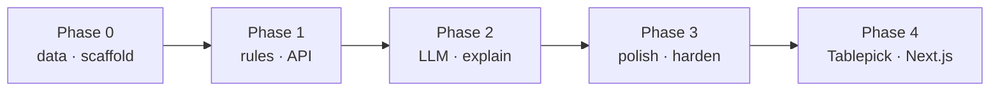
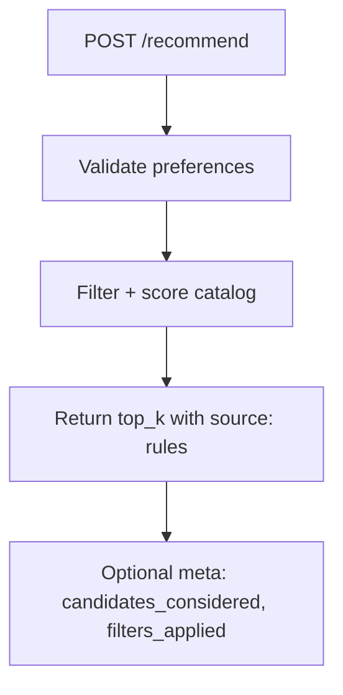
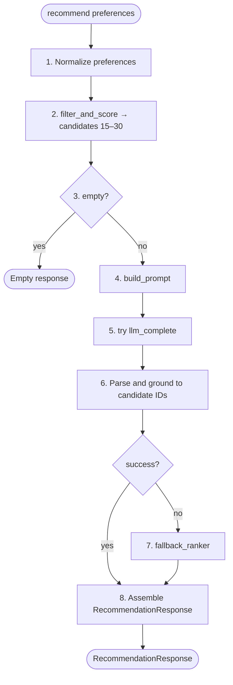
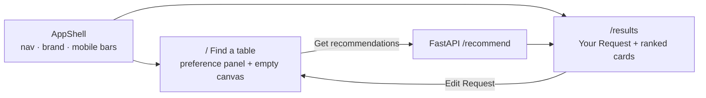

# Implementation Plan: AI-Powered Restaurant Recommendation System

Phase-wise plan to build the Zomato-inspired recommendation service described in [problemStatement.md](./problemStatement.md), following the hybrid design in [architecture.md](./architecture.md).

**Pipeline goal:** `retrieve → filter → reason → present`

**Frontend source of truth:** Stitch **Tablepick** (`stitch_tablepick_ai_dining_guide/`) — a dark, editorial dining guide. **Phase 4** implements it as a **Next.js + TypeScript + Tailwind** app, not Streamlit.

---

## Plan Overview

| Phase | Name | Primary outcome | Unlocks |
|---|---|---|---|
| 0 | Foundations | Runnable project + cleaned restaurant catalog | Everything else |
| 1 | Deterministic recommendations | Preference → filtered/ranked list via API | Valid end-to-end demo without LLM |
| 2 | LLM recommendation layer | Rank + explain + summary with fallbacks | Full problem-statement solution |
| 3 | Product polish | Observability, edge-case quality, demo runbook | Shareable API v1 |
| 4 | Tablepick frontend | Next.js UI matching Stitch, wired to `/recommend` | Demo-ready product |



**Tech default:** Python modular monolith — FastAPI backend, in-memory/parquet catalog, OpenAI-compatible LLM client — plus a **Next.js (App Router) frontend** built in **Phase 4** from the Tablepick Stitch screens.

**v1 out of scope:** accounts, booking, live menus, fine-tuning, full Zomato parity, working Saved/History/Settings (chrome only).

Phases 0–3 own the engine and API contract. **Phase 4** is the product UI: do not ship Streamlit; do not treat a generic form as the frontend.

---

## Phase 0 — Foundations

**Goal:** Scaffold the repo and produce a trusted, queryable restaurant catalog from the Hugging Face dataset.

**Maps to problem statement:** Data Ingestion  
**Maps to architecture:** Data catalog / ingest pipeline (§4.4), config (§9), repo layout (§5)

### Deliverables

- Project structure under `src/`, `data/`, `tests/`, `docs/` (leave `frontend/` for Phase 4)
- Dependency and env setup (`pyproject.toml` / `requirements.txt`, `.env.example`)
- Dataset download + clean script
- Local processed cache (`data/processed/`)
- Canonical restaurant schema + column mapping
- Quick data-profile script or notebook (row counts, nulls, top locations/cuisines)
- `README` with setup steps for Phase 0

### Work breakdown

| # | Task | Detail |
|---|---|---|
| 0.1 | Scaffold Python | Create package layout from architecture (`app`, `data`, `preferences`, `filtering`, `llm`, `engine`) — **no Streamlit `ui/`**; product UI is Phase 4 |
| 0.2 | Tooling basics (API) | Python version pin, deps: `datasets`, `pandas`, `pydantic`, `fastapi`, `uvicorn`, `python-dotenv`, `httpx` or official LLM SDK |
| 0.3 | Config module | `HF_DATASET_ID`, `DATA_CACHE_DIR`, budget bands, defaults via settings class; `CORS_ORIGINS` for the Phase 4 Next origin |
| 0.4 | Ingest raw data | Load [ManikaSaini/zomato-restaurant-recommendation](https://huggingface.co/datasets/ManikaSaini/zomato-restaurant-recommendation) |
| 0.5 | Schema mapping | Map source columns → canonical fields: `id`, `name`, `location`, `city`, `cuisine[]`, `rating`, `cost_for_two`, `rest_type`, flags |
| 0.6 | Cleaning rules | Drop rows missing name/location; coerce rating/cost to numeric; normalize cuisine strings; strip junk whitespace |
| 0.7 | Derived fields | Compute `budget_band` (`low` / `medium` / `high`), `cuisine_list`, optional `search_document` |
| 0.8 | Persist cache | Write parquet (or CSV) + version/metadata stamp; load without re-downloading if cache fresh |
| 0.9 | Catalog loader | `Catalog.load()` returns in-memory frame or DuckDB/SQLite-backed table |
| 0.10 | Smoke checks | Script prints: total rows, sample restaurants, distinct locations/cuisines count |

### Exit criteria (done when)

- [ ] Fresh clone + install + one command loads processed catalog successfully
- [ ] Canonical records contain name, location, cuisine, rating, cost (where dataset provides them)
- [ ] Budget bands assigned and documented (example bands from architecture)
- [ ] Cache path works offline after first successful ingest
- [ ] Known sample query (e.g. Bangalore restaurants) returns non-empty rows

### Dependencies / risks

| Risk | Mitigation |
|---|---|
| HF dataset schema differs from assumptions | Inspect columns first; keep mapping in one module |
| Large download / slow first run | Cache aggressively; commit small fixture sample for tests later |
| Currency or cost scale unclear | Document assumed units; make budget thresholds configurable |

**Estimated focus:** 1–2 days

---

## Phase 1 — Deterministic Recommendations

**Goal:** User preferences produce a ranked restaurant list through the API — without requiring an LLM yet. Product screens land in Phase 4.

**Maps to problem statement:** User Input + Integration Layer (filter path) + Output Display (structured fields)  
**Maps to architecture:** Preference Service (§4.3), Filter engine (§4.5), Orchestrator without LLM, API (§4.2)

### Deliverables

- Preference request model and validation
- Hard filters: location, cuisine, rating, budget
- Soft boosts for additional-preference keywords
- Pre-rank scorer (rating, votes, budget fit, keyword match)
- `POST /recommend` returning rule-based rankings
- `GET /health`
- Unit tests for budget mapping, filters, scorer
- Response shape that Phase 4 cards can render without schema changes

### Work breakdown

| # | Task | Detail |
|---|---|---|
| 1.1 | Preference schema | `location`, `budget`, `cuisine[]`, `min_rating`, `additional_preferences`, `top_k` |
| 1.2 | Normalization | Casefold location/cuisine; enum budget; clamp rating/`top_k`; keyword split from free text |
| 1.3 | Filter pipeline | Apply hard cuts in order; record which filters ran for response meta |
| 1.4 | Relaxation policy | If candidates &lt; threshold, relax softest constraint (budget band → adjacent; cuisine → broader match) |
| 1.5 | Pre-rank scorer | Weighted score (architecture sketch) → select top 15–30 candidates, return top_k for UI |
| 1.6 | Response assembler | Shape: rank, name, cuisine, rating, estimated_cost, location, explanation placeholder; include `meta` (`candidates_considered`, `filters_applied`, latency) |
| 1.7 | Rule-based explanation | Template e.g. “High rating and fits {budget} budget for {cuisine} in {location}.” |
| 1.8 | FastAPI routes | `GET /health`, `POST /recommend` with 400 on invalid input; CORS ready for Phase 4 Next origin |
| 1.9 | Tests | Fixture subset dataset; filters/scorer/schema/API contract tests |

### Suggested API behavior (Phase 1)



### Exit criteria (done when)

- [ ] `POST /recommend` accepts location, budget, cuisine, min rating, extra prefs
- [ ] Results respect hard filters (no low-rated restaurant when min rating is high)
- [ ] Budget bands keep cost within configured ranges (or documented relaxation)
- [ ] Payload includes name, cuisine, rating, estimated cost, explanation (Phase 4 card fields)
- [ ] API returns clear errors for invalid payloads
- [ ] Unit tests cover filter core paths (match, no-match, multi-cuisine)

### Dependencies / risks

| Risk | Mitigation |
|---|---|
| Fuzzy city/locality mismatch | Start with contains/exact match; log zero-result cities |
| Over-aggressive filtering | Implement relaxation order from architecture |

**Estimated focus:** 2–3 days

---

## Phase 2 — LLM Recommendation Layer

**Goal:** Replace pure rule ranking with LLM ranking, natural-language explanations, and optional summary — with reliable fallbacks. Phase 4 presents this in Tablepick’s AI voice.

**Maps to problem statement:** Integration Layer (prompt path) + Recommendation Engine  
**Maps to architecture:** Prompt builder, LLM client, parser, fallback ranker (§4.6–4.7, §7, §10)

### Deliverables

- Prompt templates (system + user + candidates + JSON schema)
- LLM client (timeouts, retries, model config)
- Structured output parser + ID grounding validation
- Recommendation orchestrator: `filter → prompt → LLM → parse → assemble`
- Response includes AI explanations + global summary
- Fallback to Phase 1 ranker on timeout/invalid JSON/API errors
- Config for `LLM_API_KEY`, model name, candidate cap, temperature
- Response fields Phase 4 binds: `summary`, per-item `explanation`, `source` (`llm` | `fallback`)

### Work breakdown

| # | Task | Detail |
|---|---|---|
| 2.1 | Prompt builder | Compact candidate serialization (id, name, cuisine, rating, cost, location, type) |
| 2.2 | System policy | Only recommend from provided IDs; no invented ratings/amenities; JSON-only output |
| 2.3 | LLM client | Provider abstraction; env-based key; temperature 0.2–0.4; timeout 15–30s |
| 2.4 | Output schema | `{ summary, recommendations: [{ id, rank, explanation, fit_notes }] }` |
| 2.5 | Parser | JSON parse; drop unknown IDs; rejoin catalog fields; enforce top_k |
| 2.6 | Repair path | One re-ask or lightweight JSON repair on malformed output |
| 2.7 | Orchestrator wiring | Flip default path to LLM; set `source: "llm"` / `"fallback"` |
| 2.8 | Fallback ranker | On failure: Phase 1 score + templated explanations; still return usable results |
| 2.9 | Safety bounds | Truncate free-text preferences; reject oversized prompts via candidate cap |
| 2.10 | Tests | Mock LLM returns golden JSON; hallucinated-id dropped; fallback path tested offline |

### Orchestrator flow (Phase 2 target)



### Exit criteria (done when)

- [x] Happy path: LLM ranks candidates and returns 1–2 sentence explanations per restaurant
- [x] Response includes overall `summary`
- [x] Hallucinated restaurants never appear (grounding check)
- [x] LLM outage still returns Phase-1-style results
- [x] Structured fields remain sourced from catalog (not free-form LLM hallucination for rating/cost)
- [x] API demo satisfies problem statement objectives; product UI is Phase 4

### Dependencies / risks

| Risk | Mitigation |
|---|---|
| API cost/latency | Cap candidates (15–30); use a small/fast model; cache identical prefs optionally |
| Unstable JSON | Strict schema instructions + parse repair + fallback |
| Prompt leakage / instruction override | Short free-text max length; system prompt hierarchy |
| Missing LLM key in local dev | Auto-fallback to rules; clear console warning |
| Long wait feels broken | Phase 4: skeleton + disable CTA; optional streaming is post-v1 |

**Estimated focus:** 2–3 days

---

## Phase 3 — Product Polish

**Goal:** Make the API demo-ready: clearer empty payloads, measurable quality, tuned edge cases. Visual polish is Phase 4.

**Maps to problem statement:** Output Display quality + overall usability  
**Maps to architecture:** Meta filters endpoint, observability (§11), deployment topology (§14), edge cases (§10)

### Deliverables

- `GET /meta/filters` for Neighborhood/cuisine dropdowns (Phase 4 autocomplete; neighbourhoods from catalog `location`, not `city`)
- Honest empty/error/partial payloads (`recommendations: []`, `source`, `meta`)
- Basic logging + latency breakdown (filter vs LLM)
- Edge-case tuning: multi-cuisine, few matches, free-text extras
- README runbook: setup, env, demo script, architecture/problem links
- Optional: request-id, simple metrics counters (success / fallback / empty)

### Work breakdown

| # | Task | Detail |
|---|---|---|
| 3.1 | Filter metadata API | Distinct **neighbourhoods from the catalog `location` column** (ranked by count) plus cuisines for Phase 4 Neighborhood autocomplete and Cuisine chips. Do **not** put `city` (Bangalore) in `locations` — city stays on the separate `cities` field |
| 3.2 | Empty-result payload | Zero hits still return 200 with empty list + suggested relaxations in `meta` (not a blank 500) |
| 3.3 | Soft preference quality | Expand keyword dictionary (family, romantic, quick, outdoor, cafe, etc.) |
| 3.4 | Relaxation telemetry | Log which constraint was relaxed and how often |
| 3.5 | Observability | Log latency stages; fallback rate; candidate counts after each filter |
| 3.6 | Config validation | Fail startup if cache missing; warm catalog on boot |
| 3.7 | Demo script | Fixed sample preference requests for walkthrough (city-wide Bangalore Italian mid-budget, plus locality examples). Tablepick Neighborhood default/preset uses a `location` value (e.g. Indiranagar), not `city` |
| 3.8 | Docs pass | Align README with actual API commands; link problem/architecture/plan |
| 3.9 | Optional stretch | Short-TTL cache of `hash(preferences)` |

### Exit criteria (done when)

- [x] First-time API demo runs from README without ad-hoc debugging
- [x] `/meta/filters` returns neighbourhoods from catalog `location` (not `city`) and cuisines
- [x] Fallback and empty-result rates are visible in logs
- [x] Common multi-locality / multi-cuisine sample queries produce sensible top-5
- [x] Team can explain hybrid design using live requests (rules + LLM)

### Dependencies / risks

| Risk | Mitigation |
|---|---|
| Polish expands endlessly | Cap to checklist above; park embeddings/chat and Saved/History as post-v1 |
| Dataset locality gaps | Prefer neighbourhoods with high support from Phase 0 profile (`location` column) |

**Estimated focus:** 1–2 days

---

## Phase 4 — Tablepick Frontend

**Goal:** Ship the product UI as a Next.js app that matches the Stitch Tablepick screens and is wired to the Phase 1–3 API — not Streamlit, not a generic form.

**Maps to problem statement:** User Input + Output Display  
**Maps to architecture:** Client / presentation layer (§4.1)  
**Maps to Stitch:** Find-a-table + Results + `DESIGN.md`

Depends on: Phase 1 `/recommend`, Phase 2 `summary` / `explanation` / `source`, Phase 3 `/meta/filters`.

### Locked decisions

| Choice | Decision | Why |
|---|---|---|
| Framework | **Next.js App Router + TypeScript** | Two Stitch screens map to routes; `next/font` for Newsreader + Geist; rewrites proxy FastAPI |
| Styling | **Tailwind CSS** with Tablepick tokens | Stitch HTML is already Tailwind; tokens live in `DESIGN.md` |
| Icons | **Material Symbols Outlined** | Matches Stitch markup |
| Neighborhood options | Catalog **`location` column** (localities), never **`city`** | `city` is a constant Bangalore; Neighborhood is BTM, HSR, Indiranagar, … from `data/processed/restaurants.parquet` |
| Backend coupling | FastAPI stays the engine; Next.js is presentation + BFF proxy | Catalog filtering and LLM stay in Python |
| Not using | Streamlit, Gradio, plain Vite SPA as the product UI | Cannot reproduce Tablepick layout, type, or interaction quality |

**Quality bar:** the live app should be recognizable as Tablepick — same IA, type pairing, tonal surfaces, hairline borders, tomato/gold hierarchy — not a generic card list wearing similar colors.

Do **not** copy Stitch HTML wholesale. Port structure and tokens into React components so screens are data-driven.

| Screen | File | Route |
|---|---|---|
| Find a table | `stitch_tablepick_ai_dining_guide/find_a_table_desktop/code.html` | `/` |
| Results | `stitch_tablepick_ai_dining_guide/results_desktop/code.html` | `/results` |
| Design system | `stitch_tablepick_ai_dining_guide/tablepick/DESIGN.md` | Tailwind theme + CSS tokens |

### Deliverables

- `frontend/` Next.js app (TypeScript, Tailwind, Tablepick tokens, fonts)
- App shell matching Stitch (desktop side nav, mobile top + bottom bars)
- Find-a-table preference form + empty canvas
- Results page: request sidebar, hero card, compact rows, AI summary/quotes
- Typed client for `/recommend` and `/meta/filters` via Next rewrite (no LLM keys in the browser)
- Loading, empty, error, and fallback states on Tablepick surfaces
- README: run API + `next dev` together

### Information architecture



**v1 nav:** Recommendations is the only working destination. Saved, History, Settings, and Account render as Stitch chrome (disabled or “coming soon”).

### Work breakdown

| # | Task | Detail |
|---|---|---|
| 4.1 | Scaffold Next.js | `frontend/` with App Router, TS strict, Tailwind, path aliases; `pnpm` or `npm` |
| 4.2 | Design tokens | Port `DESIGN.md` colors, type scale, radii, spacing into `tailwind.config` + CSS variables (`surface`, `level-0/1/2`, tomato `#E23D28`, gold `#D4B483`) |
| 4.3 | Fonts | `next/font` (or Google Fonts) for **Newsreader** (display/headlines/AI quotes italic) and **Geist** (UI/labels/data) |
| 4.4 | App shell | Desktop left nav + mobile top bar + bottom nav; brand “Tablepick” italic; catalog chip (e.g. “Bangalore catalog”) |
| 4.5 | Dev proxy | Next.js `rewrites` `/api/*` → FastAPI (`localhost:8000`); secrets stay server-side |
| 4.6 | Primitives | `Button`, `Chip`, `Input`, `Slider`, `SegmentedControl` — hairline borders, tomato focus, no drop shadows |
| 4.7 | Preference form | Neighborhood (autocomplete from `location` localities), budget Low/Medium/High, cuisine chips, min-rating slider with live `3.5+` label, vibe textarea + chips (`family-friendly`, `romantic`, `rooftop`), sticky **Get recommendations** |
| 4.8 | Empty canvas | “We'll filter the catalog first, then rank a shortlist.” plus a demo preset pill that fills the form |
| 4.9 | API client | Typed `recommend()` + `getFilters()`; map 400/5xx; disable CTA while in-flight |
| 4.10 | Results route | Persist last request (URL search params or session); left **Your Request** panel; **Edit Request** restores `/` |
| 4.11 | Result cards | Rank 1 = hero (tomato badge, Newsreader name, location • cost • rating, cuisine chips); ranks 2–5 = compact rows. **No restaurant images** |
| 4.12 | AI voice | Summary banner (gold `auto_awesome`); hero `AiQuote` (2px gold left rule, Newsreader Italic `#D4B483`); hide banner if `summary` is null |
| 4.13 | Loading | Skeleton hero + rows covering LLM latency; no spinner-only page; no double-submit |
| 4.14 | Empty / error / fallback | Zero matches: relax-filter copy; network/4xx: banner + retry; `source=fallback`: subtle honesty label |
| 4.15 | Images | **Skipped for v1** — do not render photo frames or placeholders |
| 4.16 | Meta filters | Neighborhood autocomplete from `/meta/filters`.`locations` (catalog `location` column, e.g. Indiranagar, BTM) — **never** `cities` (Bangalore). Cuisine chips from `cuisines`. Fall back to free text if meta fails |
| 4.17 | Footer meta | `k shown • n candidates • latency` from response `meta` |
| 4.18 | Null / overflow | “N/A” or hide missing rating/cost; truncate long names; no layout break |
| 4.19 | Responsive + a11y | Desktop: nav + ~380px column + canvas; mobile: stacked form, bottom nav; labeled controls; slider `aria-valuenow`; tomato focus ring (no glow) |
| 4.20 | Docs | README: `uvicorn` + `next dev`; link Stitch files; demo preset is a `location` locality (e.g. Indiranagar Italian mid-budget), not the city name |

### Component inventory

Build small, reusable pieces from Stitch — not page-sized HTML dumps.

| Component | Used on | Notes |
|---|---|---|
| `AppShell` | Both | Desktop side nav, mobile header + bottom nav |
| `BrandMark` | Shell | Newsreader italic “Tablepick” in primary |
| `PreferenceForm` | `/` | Neighborhood from catalog `location`, budget, cuisine, rating, vibe, sticky CTA |
| `EmptyCanvas` | `/` idle | Editorial headline + preset pill |
| `RequestSummary` | `/results` aside | Read-only prefs + Edit Request |
| `SummaryBanner` | `/results` | Gold AI summary; hide if null |
| `RestaurantHeroCard` | `/results` rank 1 | Tomato rank badge, display name, meta, chips, AI quote (no photo) |
| `RestaurantRowCard` | `/results` ranks 2–5 | Compact rank circle, name, location • cuisine • cost • rating |
| `AiQuote` | Hero | Gold left rule + Newsreader Italic |
| `SkeletonResults` | `/results` loading | Tonal blocks |
| `EmptyResults` / `ErrorBanner` | Both | Honest copy + retry / relax filters |
| `ResultsFooter` | `/results` | Shown / candidates / latency |

### Design system rules (do not violate)

From `DESIGN.md` — “Functional Editorial”:

1. **Tonal depth, not shadows.** Base `#0E1114`, containers `#161B20`, cards `#1C232A`. Hairline `rgba(255,255,255,0.08)`. Hover = lighter surface or 16% hairline — no lift, no blur (hero rank badge glow is the only allowed emphasis).
2. **Tomato `#E23D28`** for primary CTA, rank #1 badge, rating heat. Use sparingly.
3. **Gold `#D4B483`** only for AI insights (summary icon, quotes). Never for prices or nav.
4. **Newsreader** for restaurant names, titles, AI quotes (quotes always italic). **Geist** for labels, chips, cost, location.
5. **8px grid.** Desktop margins 64px; mobile 16px; 40px gaps between major blocks. Preference column ~380px.
6. **Primary button:** solid tomato/primary-container, 8px radius, no shadow. Secondary: ghost hairline.

### Frontend repo layout

```text
frontend/                          # Next.js App Router + TypeScript
├── app/
│   ├── layout.tsx                 # fonts, AppShell, dark canvas
│   ├── page.tsx                   # Find a table
│   ├── results/page.tsx           # Results
│   └── globals.css                # tokens, scrollbar, hairlines
├── components/
│   ├── app-shell/
│   ├── preference-form/
│   ├── results/
│   └── ui/                        # Button, Chip, Input, Slider, SegmentedControl
├── lib/
│   ├── api.ts                     # POST /recommend, GET /meta/filters
│   ├── types.ts                   # mirrors FastAPI schemas
│   └── preferences.ts             # URL state + demo preset
├── tailwind.config.ts             # Tablepick theme.extend
└── package.json
```

Python stays at repo root (`src/`, `tests/`, `data/`). Stitch HTML stays in `stitch_tablepick_ai_dining_guide/` as the visual reference — not imported at runtime.

### Local run (target)

| Process | Command (illustrative) | Port |
|---|---|---|
| API | `uvicorn` from `src/app` | `8000` |
| UI | `pnpm --dir frontend dev` | `3000` |

Browser talks only to the Next origin; Next rewrites `/api/*` to FastAPI. LLM keys stay server-side.

### Exit criteria (done when)

- [x] `frontend` starts: Tablepick shell, fonts, dark base `#0E1114`
- [x] User can submit neighbourhood (`location` locality), budget, cuisine, min rating, extra prefs on Find-a-table
- [x] Submit navigates to Results and shows hero + compact cards from `/recommend`
- [x] Cards show name, cuisine, rating, estimated cost; explanations use gold quote styling
- [x] Summary banner renders Phase 2 `summary`; fallback label when `source=fallback`
- [x] Empty, error, and loading states never blank the page
- [x] Dropdowns/chips can be driven from `/meta/filters` (Neighborhood = `locations` / `location` column)
- [x] Side-by-side with Stitch HTML: same layout, type, tomato/gold roles (photos omitted)
- [x] README runs API + Next.js without ad-hoc debugging

### Dependencies / risks

| Risk | Mitigation |
|---|---|
| Catalog has no photos | Skip imagery in v1; cards are typography-first |
| Token drift vs Stitch HTML | Prefer `DESIGN.md` + Stitch classes (`bg-level-1`, tomato/gold) over ad-hoc hex |
| Pixel-chasing unused nav | Match tokens, spacing, and component roles; do not build Saved/History |
| LLM latency feels broken | Skeleton + disable CTA; streaming is post-v1 |
| Cuisine list vs huge catalog | Popular chips + autocomplete from `/meta/filters` |

**Estimated focus:** 3–4 days

---

## Cross-Phase Workstreams

Work that spans phases; complete the *minimum* when the phase needs it.

| Workstream | Phase 0 | Phase 1 | Phase 2 | Phase 3 | Phase 4 |
|---|---|---|---|---|---|
| **Data** | Ingest + cache | Query subset for filters | Candidate payload for prompt | Meta facet stats | No restaurant images |
| **API** | — | `/health`, `/recommend` | LLM fields in response | `/meta/filters` | Consumed via Next rewrite |
| **Frontend** | — | Contract only | Contract: summary / explanation / source | Contract: filter facets | Tablepick Next.js app |
| **Tests** | Ingest smoke | Filter/schema unit + API | Mocked LLM + fallback | Demo scenarios | Manual Stitch fidelity + form → cards |
| **Docs** | Setup notes | How to run without LLM | How to set LLM keys | API README / demo path | `next dev` + Stitch links |

---

## Milestone Checklist (Definition of “v1 Done”)

Aligned to problem statement objectives:

| Objective | Met by |
|---|---|
| Takes user preferences | Phase 1 schema + Phase 4 Find-a-table |
| Uses real-world restaurant dataset | Phase 0 HF → catalog |
| LLM generates personalized, human-like recommendations | Phase 2 rank + explain + summary |
| Displays clear, useful results | Phase 4 Tablepick cards (name, cuisine, rating, cost, AI explanation) |

Additional quality bar from architecture + Stitch:

- [x] Hard constraints applied before LLM
- [x] Deterministic fallback path
- [x] No hallucinated restaurants
- [x] Secrets only via environment (never in the Next.js bundle)
- [x] Clean setup path documented
- [x] UI is Tablepick (Next.js), not a prototype form toolkit

---

## Suggested Sequencing Calendar

Illustrative full-time build (~2 weeks). Adjust to team size. Phase 4 can start as soon as Phase 1 `/recommend` is stable; bind LLM fields when Phase 2 lands.

| Day | Focus |
|---|---|
| 1 | Phase 0 catalog ingest + profile data |
| 2 | Phase 0 cache hardening + Phase 1 preference/filter modules |
| 3 | Phase 1 API + tests |
| 4 | Phase 2 prompts + client + parser |
| 5 | Phase 2 orchestrator + fallback |
| 6 | Phase 3 `/meta/filters`, observability, README |
| 7–8 | Phase 4 scaffold, tokens, AppShell, Find-a-table |
| 9–10 | Phase 4 Results cards, AI voice, states, a11y, demo path |

---

## Post-v1 Backlog (Do Not Start Before Phase 4 Exit)

From architecture future extensions — park until core works:

1. Embeddings retrieval for soft free-text similarity  
2. Multi-turn conversational refine  
3. User session / preference history (wire Stitch **History**)  
4. Saved restaurants (wire Stitch **Saved**)  
5. Map / distance ranking  
6. A/B test rules-only vs hybrid explanations  
7. Learned ranker from click logs  
8. Real restaurant photography  
9. Stream LLM summary into the banner  

---

## Working Agreements

1. **Ship vertical slices** — each phase ends with something runnable, not only libraries.  
2. **Catalog fields are source of truth** — LLM adds rank/explanation/summary, not ratings/cost.  
3. **Fallback is a feature** — demo never depends solely on live LLM availability.  
4. **Config over hardcoding** — budget bands, `top_k`, candidate caps, model id.  
5. **Test with fixtures** — CI should not need full HF download every run.  
6. **Docs stay in sync** — update this plan’s exit checklists only when intentionally rescoping.  
7. **Stitch is the UI spec** — Phase 4 follows Tablepick tokens; do not introduce a second visual language.  
8. **Frontend is Next.js (Phase 4)** — no Streamlit/Gradio for the product path.

---

## Document Map

| Doc | Role |
|---|---|
| [problemStatement.md](./problemStatement.md) | What to build and why |
| [architecture.md](./architecture.md) | How components fit together |
| **implementation-plan.md** (this file) | In what order to build it |
| `stitch_tablepick_ai_dining_guide/tablepick/DESIGN.md` | Visual system (Phase 4) |
| `stitch_tablepick_ai_dining_guide/find_a_table_desktop/code.html` | Preference / empty-canvas screen (Phase 4) |
| `stitch_tablepick_ai_dining_guide/results_desktop/code.html` | Results screen (Phase 4) |

---

## Summary

Build in five phases: **data foundation → rule-based API → LLM reasoning → API polish → Tablepick frontend**. Phases 0–3 produce a trustworthy filtered catalog and a hybrid recommendation API; Phase 4 is the product: a Next.js UI that matches the Stitch dining guide and presents grounded, explainable picks.
