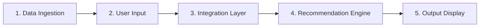

# Problem Statement: AI-Powered Restaurant Recommendation System (Zomato Use Case)

You are tasked with building an AI-powered restaurant recommendation service inspired by Zomato. The system should intelligently suggest restaurants based on user preferences by combining structured data with a Large Language Model (LLM).

---

## Objective

Design and implement an application that:

- Takes user preferences (such as location, budget, cuisine, and ratings)
- Uses a real-world dataset of restaurants
- Leverages an LLM to generate personalized, human-like recommendations
- Displays clear and useful results to the user

---

## System Workflow

### 1. Data Ingestion

- Load and preprocess the Zomato dataset from Hugging Face: [ManikaSaini/zomato-restaurant-recommendation](https://huggingface.co/datasets/ManikaSaini/zomato-restaurant-recommendation)
- Extract relevant fields such as restaurant name, location, cuisine, cost, rating, etc.

### 2. User Input

Collect user preferences:

| Preference | Examples / Options |
|---|---|
| Location | Delhi, Bangalore |
| Budget | low, medium, high |
| Cuisine | Italian, Chinese |
| Minimum rating | e.g. 3.5+ |
| Additional preferences | family-friendly, quick service |

### 3. Integration Layer

- Filter and prepare relevant restaurant data based on user input
- Pass structured results into an LLM prompt
- Design a prompt that helps the LLM reason and rank options

### 4. Recommendation Engine

Use the LLM to:

- Rank restaurants
- Provide explanations (why each recommendation fits)
- Optionally summarize choices

### 5. Output Display

Present top recommendations in a user-friendly format:

- Restaurant Name
- Cuisine
- Rating
- Estimated Cost
- AI-generated explanation
